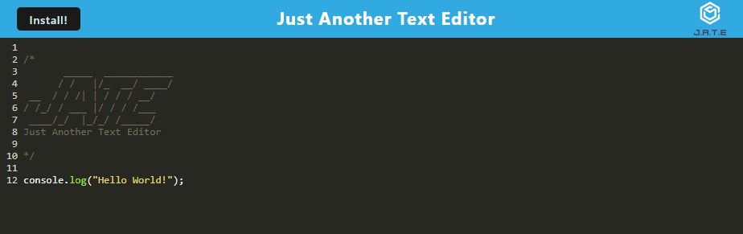
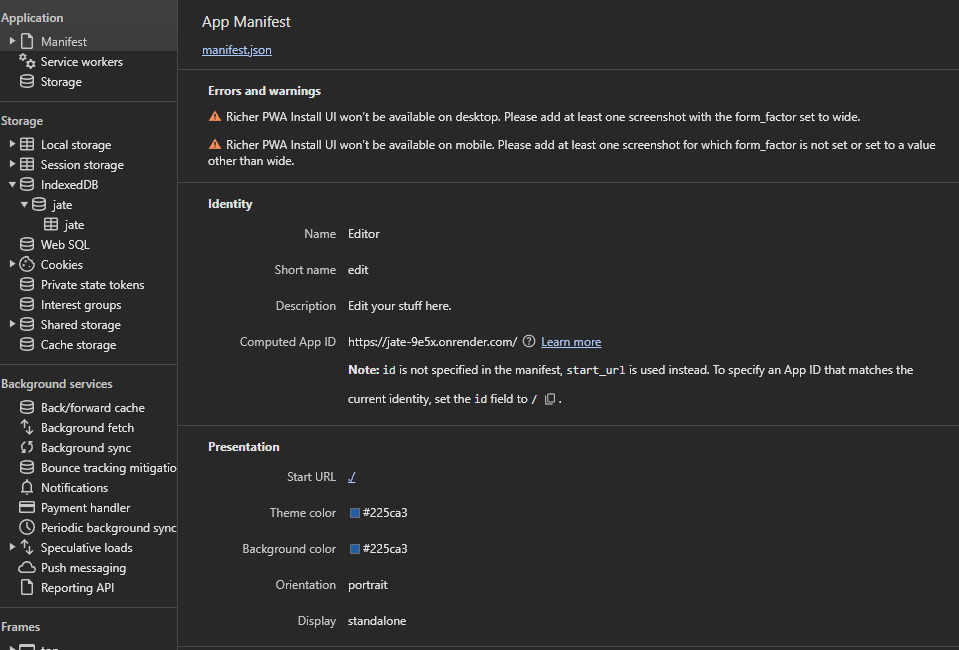
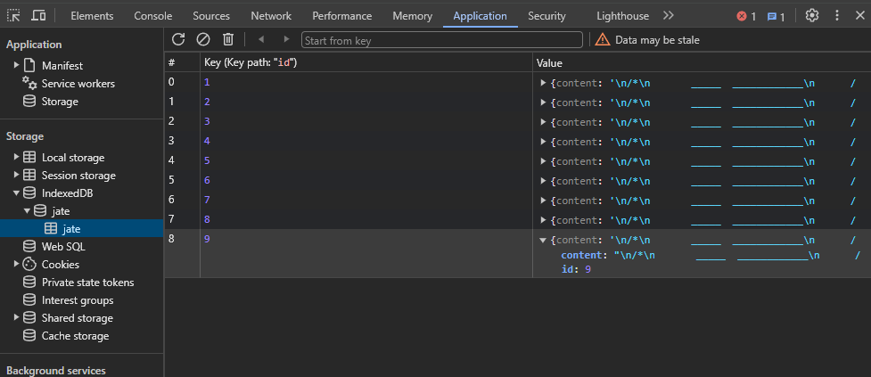

# Progessive Web Application called JATE

## Description

This is a progressive web app (PWA) called JATE (Just Another Text Editor). This text editor runs in the browser as well as offline. It uses IndexedDB to store and access data. In order to access data, I use the npm package idb. The app uses webpack plugins and service workers as well. You can also install the app.

## Installation

Run the command "npm run build" then "npm run start" in order to run locally. Also make sure to run "npm install" first.

## Deployment

### Hosted on Render (for now), here's the link: 

https://jate-9e5x.onrender.com

## Screenshots

How it looks:

Manifest.json file:

IndexedDB storage:

## License

